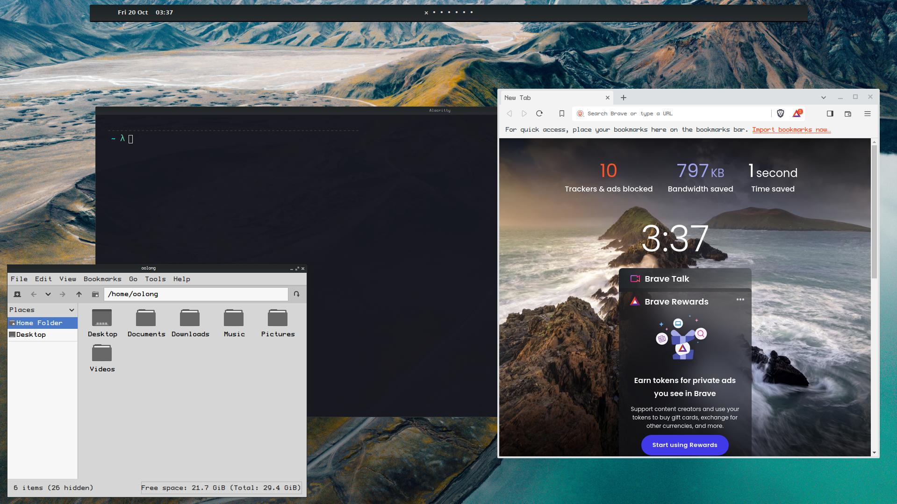

# system
a NixOS &amp; Home-manager Based laptop configuration w/ Dotfiles

# Getting started

1. install nixos via ISO on the machine
2. Run as normal user `nix-shell -p git`
3. git clone this repository in `~/.system`
4. run the `install.sh` and wait for reboot
5. Welcome Home

# About the Rice

## introductions
this is an Openbox rice with:
- alacritty
- brave browser
- Neovim
- Tmux
- ZSH
- Picom
- i3lock
- polybar
- feh for background

this Rice rely on scripts that you can found in `./dotfiles/scripts`


## keybindings
```Text
launcher
---

Win + space			// dmenu
Win + shift + space	// dmenu tool
Win + x				// dmenu power
Win + z				// dmenu windows switcher

app
---

Win + enter			// terminal
Win + shift + enter	// FileManager
Win + shift + p		// Mate-Screenshot
Win + shift + q		// kill window

Media
---

Win + m				// muted - unmuted
Win + ,				// sound down
Win + .				// sound up
Win + shift + ,		// brightness down
Win + shift + .		// brightness up

windows 
---

Win + h				// tile left
Win + j				// mini
Win + k				// maxi
Win + l				// tile right
Win + d				// toggle show desktop

Workspace 
---
Win + 1..7			// go to wk x
Win + shift + 1..7	// move wk to x
Win + o				// go to wk left
Win + p				// go to wk right
```
## Post install Screenshot

<div align="center" style="text-align:center">
</div>
